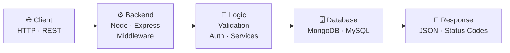

rsXri,;sr;;iihS#H5M32255AXr.,:,:,:::::::::::,,,,,,,,,,,,,,,,,::::,,,,;sXr:,,,..,,,,,,::::;;irs2;,, .
rrssirsXr;;rsHS#H5h5223hXrr.::,:::::::::::,,,,,,,,,,,,,,,,,,,::,,,:issi:,,,,.....,,,:::::;;irAs.,. .
rrrAXXAAri;iXGS9M5322555sri,i,::::::::::::,,,,,,,,,,,,,,,,,,,,,:;isr;,.,,,........,,:::::;irX2;,, ..
rsrrXA2AsiiiXS#9M3h55255sr;,;:::::::::::::,,,,,,,,,,,,,,,,,,:;;;ii:,.,,,.,.......,,:::::;;ir2r.,...,
ssssrrssrirrASS#h3h52552rX;:;,::::::::::,::::::::,,,,,,,,:;;;;;;,.....,.........,,,:::::;iiXA,.....,
rrrrsr:ii;iiAS#93335253Ars,;:,,,,,::::::,,:,:,,,,,,,,,:;;;:;;:,..................,,::::;iirA2r,,,.,,
rrrrrssr;;;;5#993h35555Arr,i:,,:,::::::,,,,,:,,,,,,,:;;;:;::......,..............,,::::;irXA;ri;,..,
rrrrrrrsr;;r3#9S5h35553Xri,i,,,::;;::::::::,,,.,::;;;:::,.........,..,.,.........,:,:::;ir2i........
rrrrrrrrsrirM#9S5h35533sri,i,,::,,;;:,,:,,,,::;;;:;iiii:,...,.,,..,,,..,...,...,,,,,:::;iXX,,,,,..,,
rrrrrrrrrrrrM##G5h35335sr;:;,,:;srrsAsirrsiiiirsi;rirsAh32AXsi;::,.,,.,..,.,,.,:,,.,,::;rA:,,......,
rrrrrrrrrrrrHS9H5h35335ir:;:,,:,isA23hHHMMM335352hMhMHMHGGSGGGH5AA2XXAsiiii,,::,::::,,:iXr.,.....,..
rrrrrrrrrrri5BBh3M35335rXrssi;;;sA2h3hHHHHHMGGGMSSGG###9SHGSSGMHGMMH352AAX52sAAss;:iirrrX,,........,
rrrrrrrrrrrriM&hhM55332isirA52A3MGHGSGHGSSS#SGSGGhG#999GGSS99G3MHhMMGh255X2h253HHh5r;;rAr...........
rrrrrrrrrrrrriGhhH333hXiisXXA3MMhhMGGHMhGGHHHGGHHHG####G##GSSGHMhMHGBBG355A253AXHSGHM2XX:,.. ....,,.
rrrrrrrrrrrrrrs3hM5525XsXA3hMGMMHHHHMHH3MGGGGGGHS#GHGGG#GHGGSSMhGHS999B9GMh33hM2hSGGHS#Mi,.......,,,
rrrrrrrrrrrrrriAM32AsrsXX5MhHGGGHHGHGHhhHGHGHHSGHHHHGGGGHGGSSSHG##9BB999#GGHHMMMHSGSSGGSGX,.....,.,,
Airrrrrrrrrrriii3h5XXAA53hMhHGGHHHHGGSGGGGSHHGGGGGSSSSS###SSSS###99999B99#SSGGHHHG#99##S#SA:...:;,,,
M5iiriirrrssrsris2AA2533hHMHHMHHHGS###GGS###S##99#9####9BB999###99999BBBB9BB99BSGG#999##GG#hXi:rrrri
53hsiriirrssrrXXXsXAA5hHHGGHMHGMHS#9999#999B99BBB9B999B9BB&&&BB9BB999BB&B&&B&&B#S#S#9##SSGS#SH3XX2A:
Sh5hAiiirrrrrsXA3533MHGGHHGHMHGHGGSBBBBBBBBBBB&&&BBBB99BBB&&&&&&&&&&&&&&&&&&&&BB##999BB9##GGSSS5M5ii
S#M252srXsrr2555hMMHHHGHHS#HGGGMhGS9B&&&&&&&&&&&&&&&BBBB&&&&@&&@@@@@@@@@@@@&&&B&99999999999#S9&BMir;
#S#H53h5hM3hHHMhMHHGSSGHSSGGGSGHGSS9B&&&&&&&&&&&&&&&&&&&&&@@@@@@@@@@@@@&&@@@&&&&BBBBBBBBBBB&&&9#3sr;
B#S#Sh5MMG##SGS#GSGHSSSGGSSGSSS#SS#9B&&&&&&&&&&&&&&&&&&&&&&@@@@@@@@@@@&&&&@@@@@@@&&&&&&&BBB99###G5r;
9B9S#S3A5MS#999#SS9HMHMHHGSS#9BB9#BBBBBB&&&&B&BBBBB&&&&&&&&@@@@@@@@@@&&&&&@@@@@@@@@@@@&&&BB99####3i;
#999S##h25MG#9B&&B9GHh2MSSS##9B&&B&&&BBBBBBBBBB9BBBBBBBB&&&@@@@&@@@@@&&&&&@@@@@@@@@@@@@&&@B999###Hi;
99#93sHBHhGHHGS##BB9GHhH#999B&&&&&&&&&&&BBBBBBBB9BBBBBBBB&&&&&&&&&&@@@@&@&&@@@@@@@@&@@@@&&B999##9#2r
52SA  ,5SS9SSGGS#99###9BB&&&&&&&@@@&&&&&&&BBB9BB9999BB&&&BB&&&&&&&&&&&@&&@@@@@@@@@@B@@@@@&9999999#h;
rMs  :i:sMSSGH###9#SS999B&&&&&&@@@&&&&BBB&&BB999999BB&&BBB9BB&&B&&B&BB&&&&@@@@@@@@BB@@@@@&9999BB9993
Si ..:;,.,shH##9999#GS#BB9BB&&&@@@@@@&&&&&&&&&BBBB999##SS###99B&BB&B9999BBB&@@@@@&&@@&@@&&&BBB9B999B
;.:::,    :GSG#9BB9BSH#9BBBBBBBBBBBB&&&@@@&&&&&B99SSGGGGGGGSS##9B9BB99####9B&@@@&&@@@&@@@&BB&&BB9B9#
.:;;,.,,,.h9HH99#99SH#9&&#GGSSSSSSSSS##9BB&&&&&&BB9#GGHGGGGGGS##B&&&@&&BBB&&@&&&&&@@@&@@&&&&@&B&BBB9
AXXr;;::, 3BMS9#S#SS#B&9M3hMMHGGSSSSSSSSS##9999999#GGHGGGGHGGS9B&&@@@@@@@@@@&&&&@@@@@@@@&BB&&&&&&BBB
522252255Ah#hHSSSSSS&BhXA5hMHGGGHHSS#SSSSSS###SS#SSGGGGGGHHHHGS9#99BB&&B&&&@@&@@@@@@@@@@@&&B&@@&B@&&
srriiiiiiriX###SSG#&#XiX23MHGSH33G#9999#SSS#######SSSGGGHMMMMHHGGGGSS##SSSSSSS#9&@@@@@@@&&&&&@@@&@@&
riii;;:,:,..HBB##GS9siX23MGS###BB#SB@@@B999##999#####SSGMhhMMHHGGS#####SSGHHMHHHGS9&&@@@@@&&&@@@&&@&
,::,,:;,,,;r29B#GHS2isA5hMGGS#GG#SH9&&&&&SH9B999999##SSHMhhhMHGS#9BBB99#SGHMhhhMMMMG#B@@@@@@&@@@&&&&
 ,,:;ii;:;AAX2S#HHhirXA5533MMMMMS99BBBBBB#99BB99999#SGGHh35hHHH#9BBB&@&BB#SH353hMMhhHS&@@@@@@@@@@&&S
rrii;,:;irs:. iSGMsirsXAA253hMHGSS#99999999999999#SHMHHMh5A2MGGS999#@@@@B&B99GhHHHh3hhG@@@@@@@@@@#A,
hhHGr:;;;i:,:;sMH3iiiirrsXA233hMHHGSS#########SSGHh55hhh52AX2MGS##9B&&&&&BHH#&&9SHM3335B@&@@@@&#s   
HMMi;;,.,:;MM3hMH2:;:::isX253hMMHHGGGGGGGGGGGHM5552A533522AAAA5hHSS99999#SSSHhMGGHh35AA#&&&@9H32srri
SGs::.,:;;XGHGhh3r,::;isX255hMMMHHHHHHHHHHHh555AA222222ArrX2AXXA23MHGGGGGGHMhh3553552A2SB&@#s;isXAA2
#A;ii;,,;:5GG5X5A;::;irsA22533hhhhMMMHHHHHHh5Assss252AAXr;rX2AXXA255hMMhh33355222AAAAA2SB@Ss::,::::i
3hh3MhXsr,2SMs53s,:;isXA2225353hhhMMHHHHGGShrrsXA3hMh352XsiisAAXA22255333352AXXXsXsXAX2#BA.....,.,,.
S#99BB9#SH5Gh3GSX,;isAXAA25553hhhMMMHHHGGSMsX3MHGMMHHMhh522XsrX222225222552AAXssrrrsXs59S;.,,::,,,:,
sHMXXA253Mh53HS#2:irrXXA255333hhhMMMHHGGSS5hHG9&@BHMHMMhhMHh3ArAh55222AAXXAXXXXssrrrssM#hAXr,.....,,
sA2ri;;:::;is3S9h:rrsssXA25333hhhMMMMHHGGSGGG#&@@&BGHHhH9@@BM3AXh352AAXXsssssXXXssrrrXHMhMGM:  .    
ssX2ArsssrrirA52A;rrrsXXA25553hhhMMMMMHHHGG#9BB9999#GHHSS9&&SM55hh352AXXsssssssXXsrrr533HHSGXsA22AAA
rAssriiirrrrrX3s2;irrsXXA222533hMMMMMMMMHHHGS99BBB9#GHHHHHSSGM35hh352AAXXsssssssssrrX5X2HHS5:;,.,,33
55AAAX;,,:,,:;rsAiirrsXAA225533hhhMMHHGGGSS###99BB9####SGHMh52A223352AAXXssssssssXss33A5GS3.      53
AsXXXAss;,,;:,rAM2;rrsXXA25533hMHHGS##99#SSSSSSSSS##9B#S#SHM5AXXA25522AXXXsXsssssXs3HhAMHX   ,,.,,G&
i.,,;::irXr;;i5hMAisrsXXA253hhMHG##99#####SS##SSSSGGHHhMMMMHHh552225222AXXXXXXXXXs2SH3535hhh5552AA#&
,,,i,    :A;rh333AisssXAA253hhHGS#####99BB9999####GHGHMMhhh3hHGHMh35552AAXXXXXXXsX3322AXA22533hhMMMM
;;::. .. ,ss2SHHMAiXXXXAA253hMGS##99B@&&&B9BBBBB999#S#SGGGGGMMGSSSGM3552AAAXXXXsAA22AXsXXXXXXAAA2225
iir;;:..:ssXMGGG5r;XAAAA2253hHGS###9BBB#SHHGSSGGS#999#SGGS#9B9SSSSGHM33522AAAXsX225AsssssssXXXAAA222
:i;;;:,,iXX53HH5;:,r2522553hMMGSSSS#####SS#SSSGHMMMHHMh5525MS&@BSHHHMh35222AAX2hAsXssXXXXXXXXXXXAAAA
;i;;:.::iA25hM3A25h2X535533hhMHGGGSSSSS##S####SSSSSGSGMMh3hhHG#9SSGHMh35222AAr52s;::;iirrssXXXAAAAAA
r;;;:,;:X53MHMh52ArrX23h33hhhMHGGSSSSSS#############SSSGGGGMMhMHGGSHh3352222i.  .,,     ..,:::;;irrr
;i;;:.:232hMhs;,.   sA5hhhhhhMMGGSSSSS###9999999####SSSGGGHMMhhMHHHHh355222;..... ..,.....      .,::
ri;. :.X23MH3;::i, .X223hMMMMMHHGSSSSS####999BB&BBB999#SGGHHMMMHHHHMh35552;.:::ii;,,::,,.    ....;ss
SGHh55A2hhM2i;;,,,,iX555hMMHGGGGSSS#######999999######SSGGHHGGGGGHHMh3352A25533hhh2,...   .. .,,:;sX
MHGGS###SSGHGGHHM35rA5hh3hMGSSSS###99999999BBBB999##SSSSGGGSS##SSGHHMh3333hhhh33555;..,,..,,,.,,::is
AAAAA2525533hhMHHG3iA5hHHHMHS#9##99BBBBBBB&BB&&&BBB9##S#SSSSSSSSSSGHhhhMMhhhMh333332XsAXsrsssssXXsss
AAA22AXXXsssrrririisX5hMGSGHGGS99BB&@&&&&&&&&@@@&BBB999####S##99SGM33hhhMMhhhh333335552XA2AAAXAXAAXX


<!-- ======================== HERO ======================== -->
<div align="center">


<br>


<br>


</div>

---

## 01 · Who Am I?

<table>
<tr>
<td width="58%" valign="top">

```text
┌────────────────────────────────────────────┐
│  NAME       →  Reejan Aryal                │
│  LOCATION   →  Kathmandu, Nepal 🇳🇵        │
│  ROLE       →  Aspiring Software Developer │
│  FOCUS      →  Web • UI/UX • AI • Security │
│  STUDYING   →  BSc CSIT                    │
│  MOTTO      →  Ideas → UI → Products       │
└────────────────────────────────────────────┘
```

I'm a developer from Nepal who loves turning ideas into interactive digital experiences.

I learn by **building real projects**: experimenting with new tech, breaking things, fixing them, and shipping something better each time.

<td width="42%" align="center">

</td>
</tr>
</table>
💫 About Me

Hi, I'm Reejan Aryal 👋
I'm a software developer from Nepal 🇳🇵 who enjoys building websites, experimenting with technology, exploring UI/UX, and turning ideas into real projects.
I enjoy learning by building — from small experiments and web interfaces to larger applications involving frontend, backend, databases and AI.
🚀 What I Do
💻 Build web applications
🎨 Explore UI/UX design
🧠 Learn programming and software engineering
🤖 Explore AI and emerging technologies
🔐 Learn cybersecurity
🛠️ Turn ideas into practical projects
📚 Continuously improve my development skills
<p align="center">
Building. 🚀
Learning. 📚
Creating. 💡
Improving. 🔥
</p> a
---

## 03 · Current System

```text
$ system --status

  USER      : reejan
  OS        : Developer Mode
  LOCATION  : Kathmandu, Nepal 🇳🇵
  STATUS    : ● ONLINE

  CURRENTLY BUILDING
  ├── 🌐 Modern web applications
  ├── 🤖 AI experiments
  ├── 🎨 Interactive UI/UX
  ├── 🔐 Cybersecurity fundamentals
  └── 🛠️ Developer tools

  CURRENT MISSION
  └── Turn ideas → interfaces → products
```

<div align="center">

</div>

---

## 04 · Tech Stack

<div align="center">

**Languages**


**Frontend**


**Backend & Databases**


**Tools & Platforms**


</div>

---

## 05 · Project Database

<table>
<tr>
<td width="50%" valign="top">

### 🛒 Taaja Bazar
`Farmer → Buyer Platform`

A low-data, Nepal-focused web platform connecting farmers and buyers with a simple, accessible experience.

**Stack:** HTML · CSS · JavaScript · Figma

</td>
<td width="50%" valign="top">

### 🛍️ Electro-Bazzar
`E-Commerce Platform`

A database-driven shopping site covering product browsing and core shopping functionality.

**Stack:** PHP · MySQL · HTML · CSS · JavaScript · XAMPP

</td>
</tr>
<tr>
<td width="50%" valign="top">

### 🤖 NepalGPT
`AI Chat Application`

An experimental AI app connecting a modern web frontend to a Python backend.

**Stack:** Python · FastAPI · Web UI

</td>
<td width="50%" valign="top">

### 🎓 ASCOL Hub
`Student Platform`

A digital platform concept for connecting ASCOL students and building community.

**Stack:** Next.js · Node.js · JavaScript · Three.js

</td>
</tr>
<tr>
<td width="50%" valign="top">

### 🧮 Scientific Calculator
`Interactive Tool`

A realistic calculator focused on logic, interaction and authentic calculator-style design.

**Stack:** JavaScript · HTML · CSS

</td>
<td width="50%" valign="top">

### 🌐 reejan.dev
`Personal Portfolio`

A highly interactive developer portfolio built around modern animation and visual storytelling.

**Stack:** Next.js · JavaScript · Framer Motion

</td>
</tr>
</table>

> 💡 Add live demo and repo links to each project, since recruiters love clickable proof.
> Example: `[Live Demo](https://...) · [Source](https://github.com/Rijanaryal/...)`

---

## 06 · Backend Knowledge Flow

<div align="center">
<i>From request → logic → data → response</i>
</div>



---

## 07 · GitHub Telemetry

<div align="center">


</div>

---

## 08 · Learning Engine

<div align="center">

</div>

```text
Web Development       [████████████████████░░]
JavaScript / React    [███████████████░░░░░░░]
Backend Development   [██████████████░░░░░░░░]
AI Development        [███████████░░░░░░░░░░░]
Cybersecurity         [█████████░░░░░░░░░░░░░]
Open Source           [███████░░░░░░░░░░░░░░░]
```

<div align="center">


</div>

---

## 09 · 2026 Objectives

```text
╔════════════════════════════════════════════════════════╗
║                       2026.exe                         ║
╠════════════════════════════════════════════════════════╣
║  [✓] Build real-world projects                         ║
║  [ ] Get stronger in full-stack development            ║
║  [ ] Master modern JavaScript                          ║
║  [ ] Build advanced Next.js applications               ║
║  [ ] Explore AI development                            ║
║  [ ] Improve cybersecurity fundamentals                ║
║  [ ] Contribute to open source                         ║
║  [ ] Build a strong developer portfolio                ║
║  [ ] Ship products instead of only ideas               ║
╚════════════════════════════════════════════════════════╝
```

---

## 10 · Contribution Matrix

<div align="center">

</div>

---

## 11 · Connect

<div align="center">

<a href="https://github.com/Rijanaryal"></a>
<a href="mailto:rijanaryal1868@gmail.com"></a>
<a href="https://www.linkedin.com/"></a>

<br><br>

💻 CODE &nbsp; 🚀 BUILD &nbsp; 🎨 DESIGN &nbsp; 🤖 EXPLORE &nbsp; 🔐 SECURE &nbsp; 📚 LEARN

<br>

**Thanks for visiting my little corner of the internet. ⭐ a repo if something caught your eye!**


</div>
