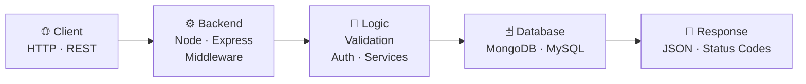

<!-- ======================== HERO ======================== -->
<div align="center">


<br>


<br>


</div>

---

## 01 · Who Am I?

<table>
<tr>
<td width="58%" valign="top">

```text
┌────────────────────────────────────────────┐
│  NAME       →  Reejan Aryal                │
│  LOCATION   →  Kathmandu, Nepal 🇳🇵        │
│  ROLE       →  Aspiring Software Developer │
│  FOCUS      →  Web • UI/UX • AI • Security │
│  STUDYING   →  BSc CSIT                    │
│  MOTTO      →  Ideas → Interfaces → Products│
└────────────────────────────────────────────┘
```

I'm a developer from Nepal who loves turning ideas into interactive digital experiences.

I learn by **building real projects**: experimenting with new tech, breaking things, fixing them, and shipping something better each time.

</td>
<td width="42%" align="center">


</td>
</tr>
</table>

---

## 02 · About Me

<table>
<tr>
<td width="48%" valign="top">

 </td> <td width="42%" align="center">  </td></tr></table> 💫 About Me  Hi, I'm Reejan Aryal 👋 I'm a software developer from Nepal 🇳🇵 who enjoys building websites, experimenting with technology, exploring UI/UX, and turning ideas into real projects. I enjoy learning by building — from small experiments and web interfaces to larger applications involving frontend, backend, databases and AI. 🚀 What I Do 💻 Build web applications 🎨 Explore UI/UX design 🧠 Learn programming and software engineering 🤖 Explore AI and emerging technologies 🔐 Learn cybersecurity 🛠️ Turn ideas into practical projects 📚 Continuously improve my development skills <p align="center"> Building. 🚀Learning. 📚Creating. 💡Improving. 🔥 </p>  

</td>
</tr>
</table>

### 🚀 What I Do

| | |
|---|---|
| 💻 **Build** | Web applications, from frontend to backend and databases |
| 🎨 **Design** | Interactive UI/UX with motion and personality |
| 🤖 **Explore** | AI tools, APIs and emerging technologies |
| 🔐 **Learn** | Cybersecurity fundamentals |
| 🛠️ **Ship** | Practical projects that solve real problems |

<div align="center">

**Building. 🚀 &nbsp; Learning. 📚 &nbsp; Creating. 💡 &nbsp; Improving. 🔥**

</div>

---

## 03 · Current System

```text
$ system --status

  USER      : reejan
  OS        : Developer Mode
  LOCATION  : Kathmandu, Nepal 🇳🇵
  STATUS    : ● ONLINE

  CURRENTLY BUILDING
  ├── 🌐 Modern web applications
  ├── 🤖 AI experiments
  ├── 🎨 Interactive UI/UX
  ├── 🔐 Cybersecurity fundamentals
  └── 🛠️ Developer tools

  CURRENT MISSION
  └── Turn ideas → interfaces → products
```

<div align="center">

</div>

---

## 04 · Tech Stack

<div align="center">

**Languages**


**Frontend**


**Backend & Databases**


**Tools & Platforms**


</div>

---

## 05 · Project Database

<table>
<tr>
<td width="50%" valign="top">

### 🛒 Taaja Bazar
`Farmer → Buyer Platform`

A low-data, Nepal-focused web platform connecting farmers and buyers with a simple, accessible experience.

**Stack:** HTML · CSS · JavaScript · Figma

</td>
<td width="50%" valign="top">

### 🛍️ Electro-Bazzar
`E-Commerce Platform`

A database-driven shopping site covering product browsing and core shopping functionality.

**Stack:** PHP · MySQL · HTML · CSS · JavaScript · XAMPP

</td>
</tr>
<tr>
<td width="50%" valign="top">

### 🤖 NepalGPT
`AI Chat Application`

An experimental AI app connecting a modern web frontend to a Python backend.

**Stack:** Python · FastAPI · Web UI

</td>
<td width="50%" valign="top">

### 🎓 ASCOL Hub
`Student Platform`

A digital platform concept for connecting ASCOL students and building community.

**Stack:** Next.js · Node.js · JavaScript · Three.js

</td>
</tr>
<tr>
<td width="50%" valign="top">

### 🧮 Scientific Calculator
`Interactive Tool`

A realistic calculator focused on logic, interaction and authentic calculator-style design.

**Stack:** JavaScript · HTML · CSS

</td>
<td width="50%" valign="top">

### 🌐 reejan.dev
`Personal Portfolio`

A highly interactive developer portfolio built around modern animation and visual storytelling.

**Stack:** Next.js · JavaScript · Framer Motion

</td>
</tr>
</table>

> 💡 Add live demo and repo links to each project, since recruiters love clickable proof.
> Example: `[Live Demo](https://...) · [Source](https://github.com/Rijanaryal/...)`

---

## 06 · Backend Knowledge Flow

<div align="center">
<i>From request → logic → data → response</i>
</div>



---

## 07 · GitHub Telemetry

<div align="center">


</div>

---

## 08 · Learning Engine

<div align="center">

</div>

```text
Web Development       [████████████████████░░]
JavaScript / React    [███████████████░░░░░░░]
Backend Development   [██████████████░░░░░░░░]
AI Development        [███████████░░░░░░░░░░░]
Cybersecurity         [█████████░░░░░░░░░░░░░]
Open Source           [███████░░░░░░░░░░░░░░░]
```

<div align="center">


</div>

---

## 09 · 2026 Objectives

```text
╔════════════════════════════════════════════════════════╗
║                       2026.exe                         ║
╠════════════════════════════════════════════════════════╣
║  [✓] Build real-world projects                         ║
║  [ ] Get stronger in full-stack development            ║
║  [ ] Master modern JavaScript                          ║
║  [ ] Build advanced Next.js applications               ║
║  [ ] Explore AI development                            ║
║  [ ] Improve cybersecurity fundamentals                ║
║  [ ] Contribute to open source                         ║
║  [ ] Build a strong developer portfolio                ║
║  [ ] Ship products instead of only ideas               ║
╚════════════════════════════════════════════════════════╝
```

---

## 10 · Contribution Matrix

<div align="center">

</div>

---

## 11 · Connect

<div align="center">

<a href="https://github.com/Rijanaryal"></a>
<a href="mailto:rijanaryal1868@gmail.com"></a>
<a href="https://www.linkedin.com/"></a>

<br><br>

💻 CODE &nbsp; 🚀 BUILD &nbsp; 🎨 DESIGN &nbsp; 🤖 EXPLORE &nbsp; 🔐 SECURE &nbsp; 📚 LEARN

<br>

**Thanks for visiting my little corner of the internet. ⭐ a repo if something caught your eye!**


</div>
